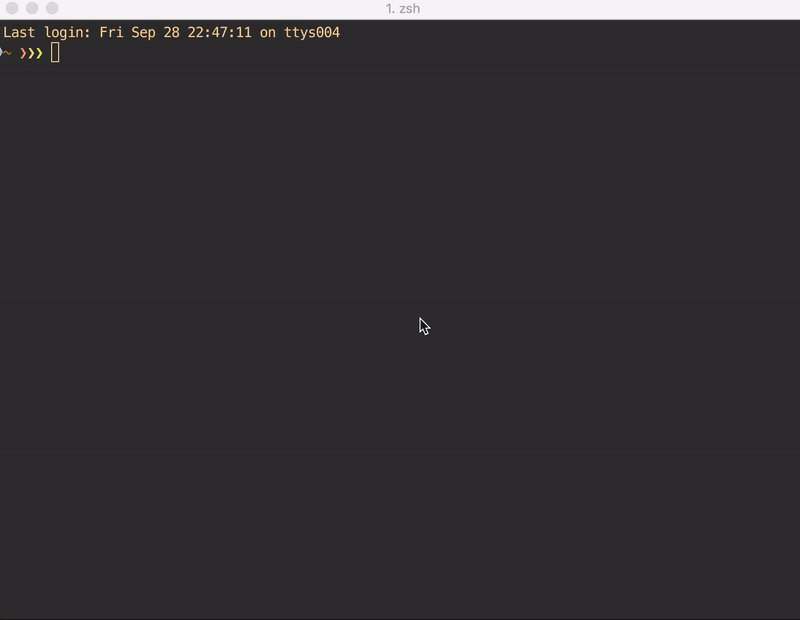

# VUJE: interactive JSON digger

Helps you navigate JSON files in an interactive incremental manner with autocompletion. Especially useful when you have a large JSON file. The idea was taken from the [jid](https://github.com/simeji/jid) project, modified and improved.

## Here's how it works

## What's special

* Emacs-like keybindings (without meta-key, though)
* Customizable separator
* Non-interactive mode

## Installation

`go get -u github.com/qoops-1/vuje`

# User Guide

## Escaping characters

Characters that need to be escaped with "\\" to be used as a part of JSON key:
* "["
* "\\"
* "." or the separator that you choose with -d option

For example, when you want to query the key in {"this[k]ey.": 1} your query should look like "this\\[k]ey\\.". If you escape any other character the escape will be ignored and the character will be parsed as usually.

## Shortcuts

### Moving JSON contents

Ctrl+N – scroll one line down

Ctrl+P – scroll one line up

Ctrl+V – scroll one screen down

Ctrl+O – scroll one screen up

Ctrl+T – scroll to top

Ctrl+R – scroll to bottom

### Moving cursor in query line

Ctrl+F – move cursor one char forwards

Ctrl+B – move cursor one char back

Ctrl+A – move cursor to the beginning

Ctrl+E – move cursor to the end

### Other

Ctrl+U – delete everything before cursor

Ctrl+K – delete everything after cursor

Ctrl+G – hide completions

Ctrl+C – exit

<Tab\> – autocomplete
